# Big-CIM

<p align="center">
  
</p>

Application mobile de gestion de compte et de commandes de ciment, developpee avec React Native et Expo.

---

## Sommaire

- [Captures d'ecran](#captures-decran)
- [Apercu](#apercu)
- [Fonctionnalites](#fonctionnalites)
- [Stack Technique](#stack-technique)
- [Architecture](#architecture)
- [Installation](#installation)
- [Lancement](#lancement)
- [Structure du Projet](#structure-du-projet)
- [Ecrans et Navigation](#ecrans-et-navigation)
- [Modeles de Donnees](#modeles-de-donnees)
- [Formulaires et Validation](#formulaires-et-validation)
- [Gestion d'etat](#gestion-detat)

---

## Captures d'ecran

### Authentification

<p align="center">
  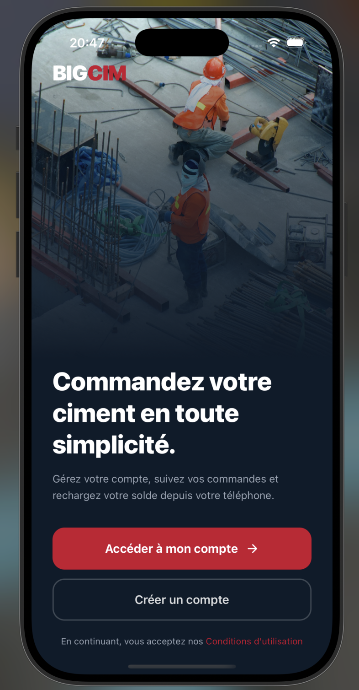
  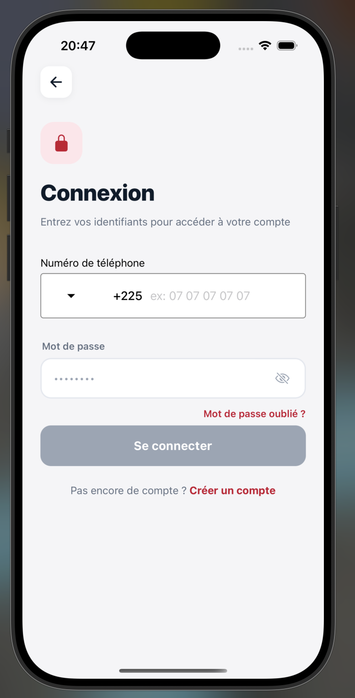
  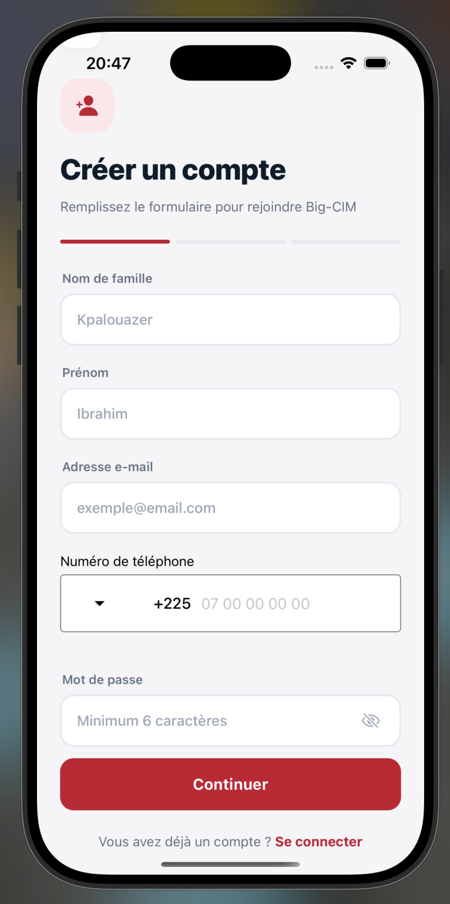
  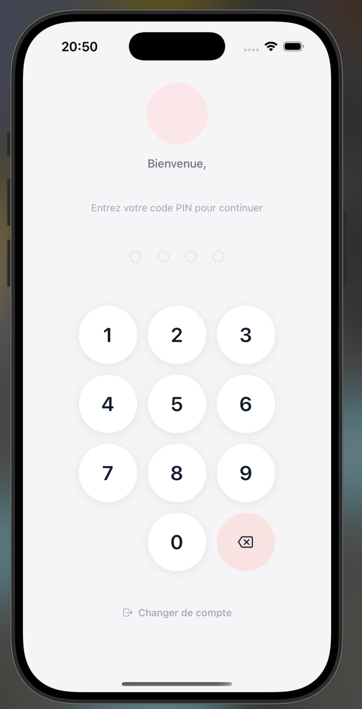
</p>

### Accueil & Compte

<p align="center">
  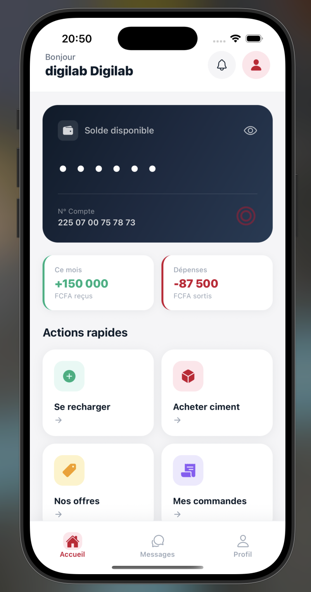
  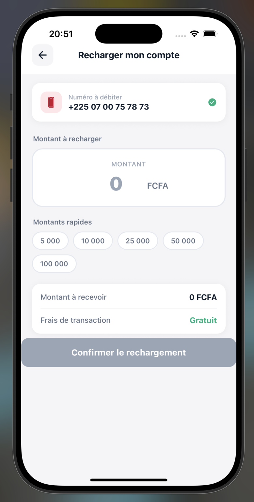
  
  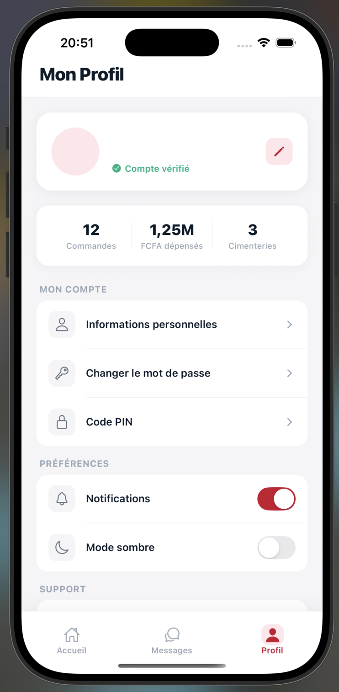
</p>

### Commandes

<p align="center">
  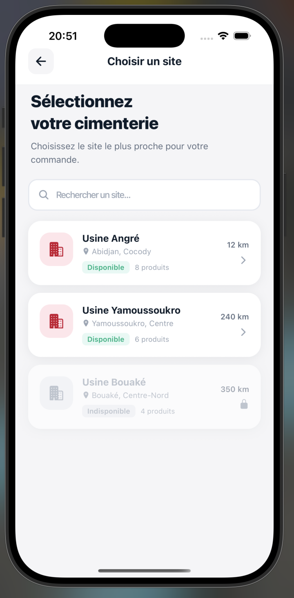
  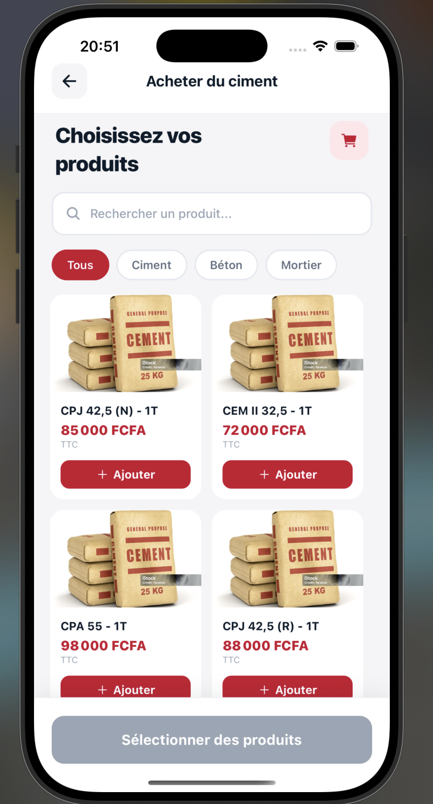
  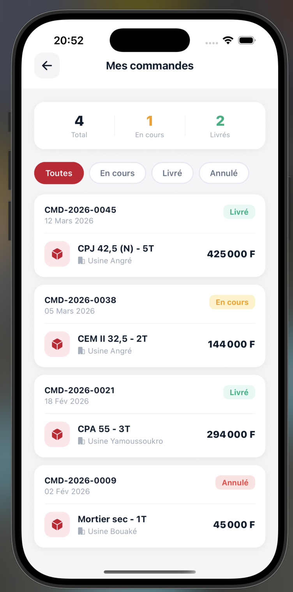
  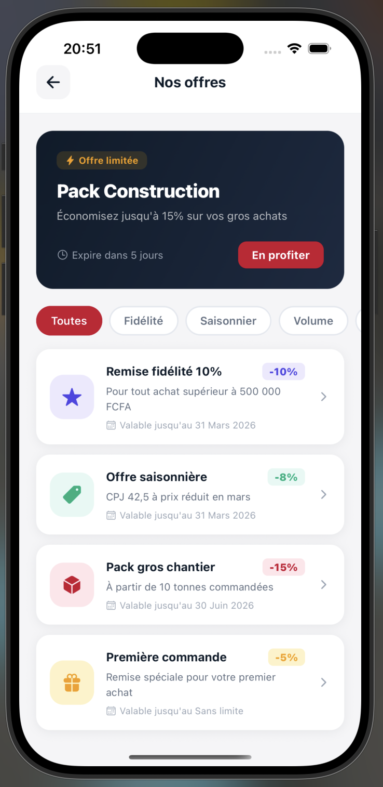
</p>

### Support & Messagerie

<p align="center">
  
  
  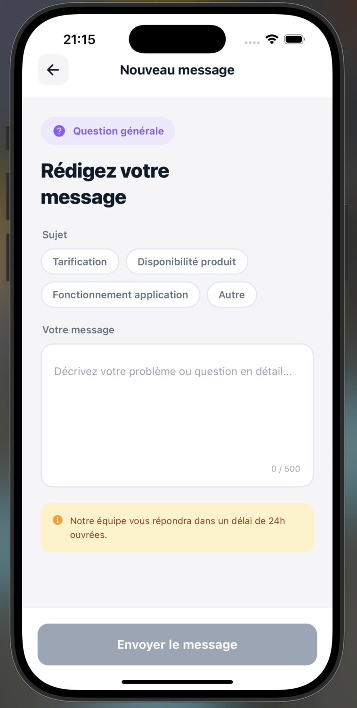
  
</p>

---

## Apercu

Big-CIM est une application mobile cross-platform (iOS, Android, Web) permettant aux clients de gerer leur compte, consulter leur solde, effectuer des recharges, passer des commandes de ciment et contacter le support.

---

## Fonctionnalites

### Authentification
- Inscription avec validation des champs (nom, prenom, telephone, email, mot de passe)
- Connexion par numero de telephone et mot de passe
- Verification OTP (code a 6 chiffres, expiration 10 minutes)
- Verification par code PIN a 4 chiffres

### Compte & Solde
- Affichage du solde avec option de masquage
- Historique des transactions (rechargements et paiements)
- Rechargement de compte avec confirmation

### Commandes
- Selection de la cimenterie (Angre, Yakro, Bouake)
- Selection du type de ciment
- Systeme de messages (Achat, Rechargement, Questions)
- Formulaires dynamiques selon le type de demande

### Contact
- Acces aux informations de contact du support

---

## Stack Technique

| Categorie | Technologie | Version |
|---|---|---|
| Framework mobile | React Native | 0.79.2 |
| Environnement | Expo | 53.0.0 |
| Langage | TypeScript | 5.3.3 |
| Routing | Expo Router | 5.0.7 |
| UI Kit | React Native Paper | 5.13.1 |
| Formulaires | React Hook Form | 7.56.0 |
| Validation | Zod | 3.24.3 |
| Requetes | TanStack Query | 5.74.4 |
| Persistance | AsyncStorage | 2.1.2 |
| Styling | twrnc (Tailwind RN) | 4.6.1 |
| Navigation | React Navigation | 7.x |
| Animations | Reanimated | 3.17.4 |
| Icones | Expo Vector Icons | 14.0.2 |

---

## Architecture

```
big-cim/
├── app/                        # Routing Expo Router
│   ├── _layout.tsx             # Layout racine (providers)
│   └── index.tsx               # Point d'entree principal
├── components/
│   ├── screen/                 # Ecrans complets
│   ├── widget/                 # Composants reutilisables
│   │   ├── buttons/
│   │   ├── cards/
│   │   ├── input/
│   │   ├── header/
│   │   ├── bottom-tabs/
│   │   ├── message-forms/
│   │   ├── alert-dialog/
│   │   ├── contact-us/
│   │   ├── home/
│   │   └── profil/
│   ├── ui/                     # Composants UI specifiques a la plateforme
│   └── objects/                # Modeles, services, donnees
│       ├── interfaces.ts       # Types TypeScript
│       ├── services.ts         # Logique metier
│       └── all-data_db.tsx     # Base de donnees en memoire (dev)
├── hooks/                      # Hooks React personnalises
├── constants/                  # Constantes (couleurs, etc.)
└── assets/                     # Images et polices
```

**Principes d'architecture :**
- Separation des responsabilites : ecrans / widgets / services / donnees
- Routing declaratif avec Expo Router (file-based)
- Couche service pour la logique metier
- Schemas Zod colocalisés avec les formulaires
- Pas d'API externe — donnees simulees en developpement

---

## Installation

### Prerequis

- Node.js >= 18
- npm ou yarn
- Expo CLI (`npm install -g expo-cli`)
- Pour iOS : Xcode (macOS uniquement)
- Pour Android : Android Studio + emulateur configure

### Cloner et installer

```bash
git clone <url-du-repo>
cd big-cim
npm install
```

---

## Lancement

```bash
# Demarrer le serveur de developpement
npm start

# iOS
npm run ios

# Android
npm run android

# Web
npm run web
```

Scannez le QR code avec **Expo Go** (iOS/Android) pour tester sur un appareil physique.

---

## Structure du Projet

### `app/`

Point d'entree du routing Expo Router. `_layout.tsx` encapsule l'application dans les providers necessaires (ThemeProvider, PaperProvider).

### `components/screen/`

Ecrans principaux de l'application. Chaque fichier correspond a une vue complete.

### `components/widget/`

Composants reutilisables organises par domaine fonctionnel. Concu pour etre compose dans les ecrans.

### `components/objects/`

- `interfaces.ts` : tous les types TypeScript (`User`, `Transaction`, `OTP`, etc.)
- `services.ts` : services d'authentification et logique applicative
- `all-data_db.tsx` : base de donnees in-memory pour le developpement

---

## Ecrans et Navigation

### Flux d'authentification

```
FirstScreen
├── Login → Pin → Main
└── Register → Verify (OTP) → PinSetup → Main
```

### Application principale (Bottom Tabs)

```
Main
├── Home
│   ├── Rechargement → TransactionHistory
│   ├── Factories → ChooseCement → Cart → OrderConfirmation
│   ├── Orders → OrderDetail
│   └── Offers
├── Contact-us
│   ├── Choose → SendMessage
│   └── MessageDetail
└── Profil
    ├── EditProfile
    └── Notifications
```

### Detail des ecrans

| Ecran | Fichier | Description |
|---|---|---|
| FirstScreen | `first-screen.tsx` | Splash / accueil |
| Login | `login.tsx` | Connexion telephone + mot de passe |
| Register | `register.tsx` | Inscription avec validation Zod |
| PhonenumberVerify | `phonenumber-verify.tsx` | Verification OTP 6 chiffres |
| PinSetup | `pin-setup.tsx` | Creation du code PIN en 2 etapes |
| PinCodeScreen | `code-pin.tsx` | Saisie PIN 4 chiffres |
| Home | `home.tsx` | Tableau de bord avec solde |
| Rechargement | `rechargement.tsx` | Recharge du compte |
| TransactionHistory | `transaction-history.tsx` | Historique des transactions |
| ChooseFactory | `factories.tsx` | Selection de la cimenterie |
| ChooseCement | `choose-cement.tsx` | Catalogue produits et panier |
| Cart | `cart.tsx` | Panier et recapitulatif commande |
| Orders | `orders.tsx` | Liste de toutes les commandes |
| OrderDetail | `order-detail.tsx` | Suivi et detail d'une commande |
| OrderConfirmation | `order-confirmation.tsx` | Confirmation apres commande passee |
| Offers | `offers.tsx` | Offres et promotions disponibles |
| Notifications | `notifications.tsx` | Centre de notifications |
| ContactUs | `contact-us.tsx` | Fils de messages avec le support |
| ChooseMessage | `choose-message.tsx` | Selection categorie de message |
| SendMessage | `send-message.tsx` | Formulaire de message dynamique |
| MessageDetail | `message-detail.tsx` | Chat avec le support |
| EditProfile | `edit-profile.tsx` | Modification des infos personnelles |
| Profil | `profil.tsx` | Profil, parametres et deconnexion |

---

## Modeles de Donnees

```typescript
interface User {
  id: string;
  firstName: string;
  lastName: string;
  email: string;
  password: string;
  phoneNumber: string;
  pinCode: string;
  balance: number;
  createdAt: Date;
}

interface Transaction {
  id: string;
  amount: number;
  date: Date;
  transactionType: 'recharge' | 'paiement';
  status: string;
}

interface OTP {
  phoneNumber: string;
  code: string;       // 6 chiffres
  expiresAt: Date;    // +10 minutes
}
```

---

## Formulaires et Validation

Les formulaires utilisent **React Hook Form** avec des schemas **Zod** pour la validation :

```typescript
// Exemple : schema d'inscription
const registerSchema = z.object({
  firstName: z.string().min(2),
  lastName: z.string().min(2),
  phoneNumber: z.string().min(8),
  email: z.string().email(),
  password: z.string().min(6),
});
```

Composants de saisie disponibles :
- `Input` — champ texte standard
- `SecureInput` — champ mot de passe avec toggle
- `PhoneInput` — saisie numero international avec indicatif pays
- `SearchBar` — barre de recherche
- Code OTP (`react-native-confirmation-code-field`)
- Clavier PIN personnalise (`react-native-pin-view`)

---

## Gestion d'etat

| Besoin | Solution |
|---|---|
| Etat des formulaires | React Hook Form |
| Donnees serveur / mutations | TanStack Query (React Query) |
| Persistance locale | AsyncStorage |
| Theming global | React Context (ThemeProvider) |
| Etat local des composants | useState / useEffect |

---

## Remarques de developpement

- L'application utilise actuellement des **donnees simulees** (pas d'API reelle). Les services (`services.ts`) et la base de donnees in-memory (`all-data_db.tsx`) sont prevus pour etre remplaces par des appels API reels.
- Le projet est sur la branche `dev`. La branche `main` est la branche de production.
- Identifiant Android : `com.yols225.bigcim`
- Orientation : portrait uniquement